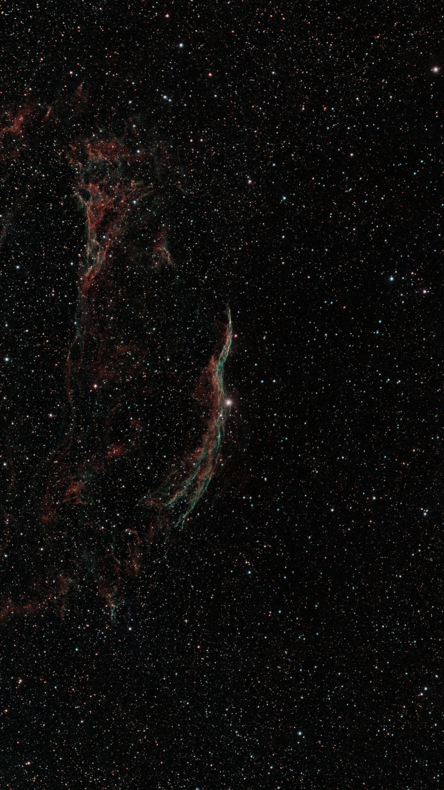
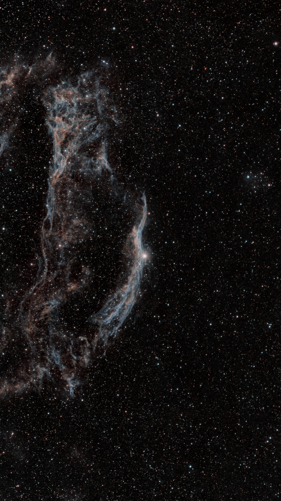

# Seestar HOO: Siril Ha/OIII extraction from lights only

A Siril script that extracts Ha and OIII from one-shot-colour dual-narrowband data using **lights only**. No darks, flats or biases.

Written for the ZWO Seestar smart telescopes, which give the user light frames and nothing else. Tested on a Seestar S30 Pro with Siril 1.4.4 on Windows.

## Why this exists

Siril ships `OSC_Extract_HaOIII.ssf`, and it works well, but it requires `lights`, `darks`, `flats` and `biases` folders and stops if they are missing. Smart telescopes don't produce calibration frames, so the built-in script can't be used on their data without editing it.

The community variants have the same problem. `OSC_Extract_HaOIII_nodarks.ssf` drops darks but still expects biases and flats, and uses pre-1.2 command syntax. At the time of writing there is nothing in the official Siril script repository that combines HaOIII extraction with lights-only input.

This script fills that gap.

## What it does

1. Converts the light frames into a sequence, keeping the Bayer matrix intact
2. Runs `calibrate` with no master frames, for cosmetic correction and CFA equalisation only
3. Splits each frame into Ha (red photosites) and OIII (green and blue photosites)
4. Drizzles the Ha 2× during registration to bring it to full size
5. Registers and stacks each channel independently
6. Outputs two mono masters: `Ha_result.fit` and `OIII_result.fit`

## Three design decisions worth knowing

**No `-debayer` anywhere.** The Bayer matrix must survive to the extraction step. Debayering first is the most common cause of `seqextract_HaOIII` failing.

**Drizzle rather than resampling.** Extraction leaves Ha at half size, and the usual fix is `-resample=ha`, which upsamples by interpolation. Drizzling the Ha 2× during registration instead reconstructs genuine detail from the sub-pixel dither between frames. On undersampled data, which the S30's 150 mm focal length certainly is, the difference in filament detail is clearly visible.

Do not add `-resample` back in alongside the drizzle scale. Use one or the other, or the two channels come out at different sizes and won't composite.

**No `linear_match` at the end.** Several existing scripts finish by linear-matching OIII against Ha. That rescales the faint OIII towards the much brighter Ha, which works directly against the reason for extracting in the first place. This script leaves both channels at their native levels so they can be stretched independently in post, which is where the OIII signal actually gets revealed.

## Usage

1. Save the `.ssf` file to a folder of your own, then add that folder in Siril under Preferences → Scripts. Don't use Siril's own scripts directory, updates overwrite it.
2. Put your subs in a folder named `lights`.
3. Set Home to the folder **containing** `lights`, not `lights` itself.
4. Run the script from the Scripts menu.

Intermediates go to a `process` folder, which can be deleted afterwards. The two results land alongside it. Drizzle makes that folder considerably larger than a normal stack, so check free space before running on a long session.

## What comes next

The script stops at two linear mono masters. From there:

- Plate solve, background-extract and denoise each channel
- Stretch each **separately**, pushing the OIII considerably harder than the Ha
- Combine with RGB Composition: Ha to red, OIII to green and blue, using the dialog's alignment
- SCNR to remove the green cast, then saturation

For dense star fields, consider processing the nebula starless and borrowing the star layer from a conventionally stacked version of the same data. HOO stars are built from two independently registered channels and tend to come out soft, while the conventional stack gives tighter stars with natural colour.

## Example

Western Veil, NGC 6960. Seestar S30 Pro, 300 × 30 s, 2.5 hours total, Bortle 4.

 

Left: conventional RGB stack. Right: HOO via this script.

## Notes

- Requires Siril 1.4 or later
- Works with any OSC camera behind a dual-band Ha/OIII filter, not just Seestar
- Best results on targets with genuinely strong OIII, such as the Veil, the Crescent or the Rosette. On Ha-dominated targets the extraction still works, but there may not be enough OIII to produce visible colour separation

## Credit and licence

Derived from `OSC_Extract_HaOIII.ssf`, part of Siril, by the Siril team.

Licensed GPL-3.0-only, matching Siril.

Tomasz, [@lasektom](https://github.com/lasektom) on GitHub, [@deepskytom](https://www.instagram.com/deepskytom/) on Instagram. Questions and bug reports: please use the [issue tracker](https://github.com/lasektom/siril-seestar-hoo/issues).
